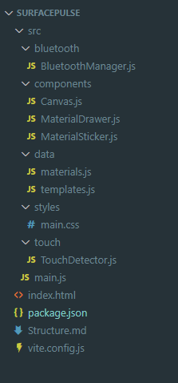

# Surface Pulse — 项目文档

## 项目简介

Surface Pulse 是一个触觉反馈网页应用，主要面向 iPhone、iPad 和 Windows Chrome 浏览器。

用户把不同材质的圆形贴纸（玻璃、木头、金属等）拖到画布上，用手指触摸不同材质区域时，网页通过蓝牙把「材质类型 + 接触面积」发送给 MCU（单片机），MCU 驱动用户指甲上的振动马达产生对应的触觉反馈。

---

## 用户操作流程

```
1. 打开网页 → 看到空白画布（默认状态 = 无材质）
2. 点击右侧 ▶ 按钮 → 打开材质库抽屉
3. 从抽屉拖出材质贴纸（玻璃 / 木头 / 金属…）放到画布上
   ── 或 ──
   点击抽屉里的模板 → 一键加载预设好的贴纸布局
4. 点击顶部"未连接"按钮 → 选择蓝牙设备连接 MCU
5. 用手指（或鼠标）触碰画布上的材质贴纸
   → 蓝牙发送：{ material: "glass", area: 1234 }
   → MCU 收到后控制振动马达
6. 手指离开 → 发送：{ material: "none", area: 0 }
```

---

## 项目文件结构

```
SurfacePulse/
│
├── index.html                    # 网页骨架（HTML 结构）
├── package.json                  # 项目配置 + 依赖声明
├── vite.config.js                # Vite 构建工具配置
│
└── src/                          # 所有源代码
    │
    ├── main.js                   # 入口文件（程序启动点）
    │
    ├── styles/
    │   └── main.css              # 全部样式（颜色、布局、动画）
    │
    ├── data/                     # 纯数据文件（不含逻辑）
    │   ├── materials.js          # 材质定义列表（6种材质）
    │   └── templates.js          # 预设模板定义（4个模板）
    │
    ├── bluetooth/
    │   └── BluetoothManager.js   # 蓝牙连接与数据发送
    │
    ├── touch/
    │   └── TouchDetector.js      # 触摸 + 鼠标事件检测
    │
    └── components/               # UI 组件
        ├── Canvas.js             # 画布控制器（核心调度）
        ├── MaterialSticker.js    # 单个材质贴纸
        └── MaterialDrawer.js     # 右侧材质库抽屉
```

---

## 每个文件是干嘛的

### `index.html` — 网页骨架

定义页面的所有 HTML 元素，但不包含任何逻辑。
包含：顶部栏、画布区域、三角按钮、材质库抽屉、遮罩层、触点指示器。
所有交互逻辑由 JS 模块处理。

---

### `src/main.js` — 程序入口

整个应用从这里启动。它做三件事：
- 创建 BluetoothManager、Canvas、MaterialDrawer 三个核心实例
- 把它们互相串联（Canvas 需要蓝牙，Drawer 需要 Canvas）
- 绑定顶部栏蓝牙按钮的点击事件（连接/断开）

---

### `src/styles/main.css` — 全部样式

包含整个应用的视觉设计：
- 深色主题（变量定义在 `:root` 里）
- 毛玻璃效果顶部栏
- 画布背景（网格 + 渐变光晕）
- 材质贴纸的颜色渐变（`.mat-glass`、`.mat-wood` 等 6 种）
- 抽屉滑入/滑出动画
- 触点指示圆圈样式
- 手机/iPad 安全区域适配（`env(safe-area-inset-*)`）

---

### `src/data/materials.js` — 材质数据

定义 6 种材质，每种包含：
- `id`：英文标识符，蓝牙发送时用这个（如 `"glass"`）
- `label`：中文名（如 `"玻璃"`）
- `icon`：Emoji 图标
- `cssClass`：对应的 CSS 颜色类名
- `size`：贴纸直径（像素）

如需添加新材质，在这个文件加一条数据，并在 `main.css` 加对应的颜色样式即可。

---

### `src/data/templates.js` — 模板数据

定义 4 个预设布局模板（基础材质 / 自然质感 / 科技材质 / 全材质）。
每个模板包含若干贴纸，位置用画布宽高的百分比表示（0.0 ~ 1.0），
这样在任何屏幕尺寸上都能按比例布局。

---

### `src/bluetooth/BluetoothManager.js` — 蓝牙管理器

负责所有蓝牙通信：
- 使用 **Web Bluetooth API**（Chrome 原生支持）
- 连接 MCU 上的 **Nordic UART Service（NUS）**
- 每次触摸时发送 JSON：`{"material":"glass","area":1234}`
- 监听意外断开事件，自动更新 UI 状态

> **蓝牙 UUID**：如果你的 MCU 用的不是 Nordic UART 协议，需要修改文件顶部的 `SERVICE_UUID` 和 `TX_CHARACTERISTIC`。

---

### `src/touch/TouchDetector.js` — 触控检测器

监听画布上的输入事件，判断「触碰了哪个材质」+「接触面积多大」：

| 平台 | 使用的事件 | 面积计算方式 |
|------|-----------|------------|
| iPhone / iPad | Touch 事件（`touchstart`/`touchmove`） | `π × radiusX × radiusY`（手指越大面积越大） |
| Windows Chrome | Pointer 事件（`pointerdown`/`pointermove`） | 固定模拟值（鼠标没有真实接触面积） |

命中检测原理：计算触点到每个贴纸圆心的距离，距离 ≤ 贴纸半径即为命中。

---

### `src/components/Canvas.js` — 画布控制器

整个应用的"调度中心"，连接所有模块：

```
用户触摸
  → TouchDetector 检测到命中材质
  → Canvas._onTouch() 被调用
    → 高亮对应贴纸
    → 显示触点指示圆圈
    → 调用 BluetoothManager.send() 发送蓝牙数据
```

同时管理画布上所有贴纸的增加、删除、清空，以及模板加载。

---

### `src/components/MaterialSticker.js` — 材质贴纸

画布上可拖动的圆形贴纸，每个贴纸：
- 显示材质图标和名称
- 支持触摸拖动（iPhone/iPad）和鼠标拖动（Windows Chrome）
- 触碰时显示发光高亮效果（`.active-touch` CSS 类）
- 右上角有删除按钮（悬停时出现）

---

### `src/components/MaterialDrawer.js` — 材质库抽屉

右侧滑入的面板，包含两个区域：

**材质贴纸区**：显示 6 种材质的小圆贴纸，支持拖拽到画布
- 拖拽时生成一个跟随手指/鼠标的「幽灵元素」
- 松手时在落点创建真实贴纸（如果落在画布范围内）

**模板区**：显示预设模板卡片，点击后清空画布并加载模板

---

## 蓝牙数据协议

每次触摸事件发送一条 JSON 消息给 MCU：

```json
// 触碰材质时
{"material": "glass", "area": 1256}

// 手指/鼠标松开时
{"material": "none", "area": 0}
```

`area` 单位是像素²，MCU 可以用面积大小映射振动强度。

---

## 启动方式

### 第一步：安装 Node.js

前往 [nodejs.org](https://nodejs.org) 下载 LTS 版本安装。

### 第二步：安装依赖并启动开发服务器

打开命令提示符（Win + R → 输入 `cmd`），运行：

```bash
cd Desktop\SurfacePulse
npm install
npm run dev
```

### 第三步：用浏览器打开

- **Windows Chrome**：打开 `http://localhost:5173`
- **手机 / iPad（同一局域网）**：打开 `http://[电脑IP]:5173`
  （电脑 IP 查询：`ipconfig` → IPv4 地址）

> **注意**：Web Bluetooth 要求 HTTPS 或 localhost。
> 局域网 IP 访问如需蓝牙功能，需配置 HTTPS（开发阶段用 localhost 即可）。

### iOS 蓝牙说明

iOS Safari **不支持** Web Bluetooth API。
需要安装第三方浏览器：
- [Bluefy](https://apps.apple.com/app/bluefy-web-ble-browser/id1492822055)（推荐）
- WebBLE

Android Chrome 和 Windows Chrome 原生支持，无需额外安装。





